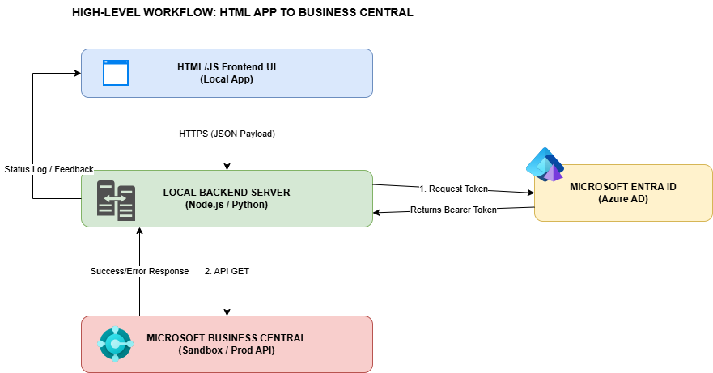
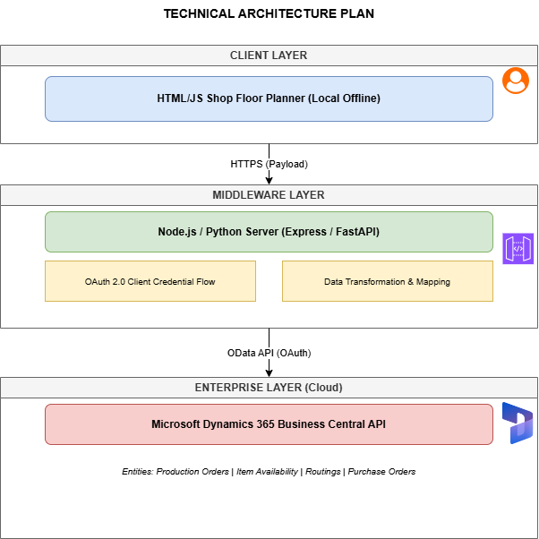

# Business Central FastAPI Integration

A FastAPI service that sits between a browser dashboard and an existing **Microsoft Dynamics 365 Business Central (BC) HTTP API**. It provides application login, role-based access control (RBAC), admin-configurable BC authentication, and a server-rendered dashboard.

> **Scope:** The app talks to Business Central **only over its HTTP API**. It never connects to the BC database. BC remains a separate, remote system.

---

## Table of Contents

1. [Features](#features)
2. [Architecture](#architecture)
3. [Tech Stack](#tech-stack)
4. [Quick Start](#quick-start)
5. [Configuration](#configuration)
6. [Business Central Setup](#business-central-setup)
7. [Roles and Access](#roles-and-access)
8. [API Reference](#api-reference)
9. [Project Structure](#project-structure)
10. [Troubleshooting](#troubleshooting)
11. [Security](#security)
12. [Contributing](#contributing)

---

## Features

- **App authentication:** JWT stored in an HttpOnly cookie, bcrypt password hashing
- **RBAC:** `admin` and `viewer` roles
- **Pluggable BC authentication:** Entra ID (OAuth 2.0 client credentials) or Basic Auth, selected at runtime by an admin
- **Admin console:** user management, BC connection settings, one-click connection test
- **Dashboard:** BC health and data checks (companies, items)
- **Zero-setup persistence:** SQLite, auto-created on first run

---

## Architecture





| Component | Responsibility |
|---|---|
| **Routers** (`auth`, `dashboard`, `admin`) | HTTP routes, session checks, role enforcement |
| **Security** | Password hashing, JWT issue/verify |
| **Config manager** | Reads and writes BC settings in SQLite; values are read on each BC request, so changes apply without a restart |
| **`BusinessCentralClient`** | Single entry point for BC calls: `health_check()`, `get_companies()`, `get_items()` |
| **`bc_auth` providers** | `entra_id` and `basic_auth` implement a shared base interface; the client selects one from saved settings |

**Extending the integration:** add new BC calls to `BusinessCentralClient`. To support another auth scheme, add a provider under `services/bc_auth/` implementing `base.py`.

---

## Tech Stack

| Layer | Technology |
|---|---|
| Backend / server | Python 3.11+, FastAPI, Uvicorn |
| Data | SQLite, SQLAlchemy 2.x, Pydantic v2 |
| Auth | JWT (HttpOnly cookie), Passlib + bcrypt |
| BC client | HTTPX |
| UI | Jinja2, HTML, CSS, JavaScript |

---

## Quick Start

**Prerequisites:** Python 3.11+, Git, and BC API access details from your Dynamics/IT administrator.

```powershell
# 1. Clone
git clone https://github.com/IMRJ-1998/business-central-fastapi-integration.git
cd business-central-fastapi-integration

# 2. Virtual environment
py -3 -m venv .venv
.venv\Scripts\Activate.ps1

# 3. Dependencies
python -m pip install --upgrade pip
pip install -r requirements.txt

# 4. Environment file
copy .env.example .env

# 5. Run
python run.py
```

The app is now at **http://127.0.0.1:8000** and `GET /health` returns `{"status":"ok"}`.

<details>
<summary>PowerShell blocks script activation?</summary>

Either allow scripts for the current session only:

```powershell
Set-ExecutionPolicy -Scope Process -ExecutionPolicy RemoteSigned
```

or skip activation and call the venv interpreter directly:

```powershell
.venv\Scripts\python.exe -m pip install -r requirements.txt
.venv\Scripts\python.exe run.py
```

Command Prompt users can run `.venv\Scripts\activate.bat`.
</details>

### First login

On first start, the app seeds an administrator:

| Username | Password |
|---|---|
| `admin` | `AdminPassword123!` |

> **Change this immediately** on any shared or deployed environment: create a new admin under **Admin → Users**, then delete the default account.

Then connect to BC: **Admin → BC Settings**, fill in the details, save, and click **Test Connection**.

---

## Configuration

### Environment variables (`.env`)

| Variable | Default | Description |
|---|---|---|
| `JWT_SECRET_KEY` | placeholder | Signing key. **Must** be a long random value outside local dev |
| `JWT_EXPIRE_MINUTES` | `480` | Session lifetime |
| `COOKIE_SECURE` | `false` | Set `true` when served over HTTPS |

`.env`, `bc_app.db` and `.venv/` are git-ignored. Do not commit them.

---

## Business Central Setup

Configured at runtime in **Admin → BC Settings** and stored in the local SQLite database. Choose one authentication type.

### Option A: Entra ID (recommended)

OAuth 2.0 client credentials. The app obtains a token from Entra ID and sends it as `Authorization: Bearer <token>`.

| Setting | Purpose |
|---|---|
| API Base URL | Existing BC API endpoint |
| Tenant ID | Entra tenant identifier |
| Client ID | App registration identifier |
| Client Secret | App registration credential |
| Scope | Token scope. Default: `https://api.businesscentral.dynamics.com/.default` |
| Company ID | Optional BC company identifier |

The Entra app registration and BC permission setup depend on your BC environment and should be completed by your Dynamics/IT administrator.

### Option B: Basic Authentication

Provide **Username** and **Password / Access Key**. Use this only if the target API explicitly supports Basic Auth.

---

## Roles and Access

| Capability | `admin` | `viewer` |
|---|:---:|:---:|
| View dashboard | ✅ | ✅ |
| Manage users | ✅ | ❌ |
| Configure and test BC connection | ✅ | ❌ |

---

## API Reference

| Method | Path | Access | Description |
|---|---|---|---|
| `GET` | `/` | Authenticated | Dashboard |
| `GET` | `/health` | Public | Liveness check |
| `GET` / `POST` | `/login` | Public | Login page / submit credentials |
| `POST` | `/logout` | Authenticated | End session |
| `GET` | `/admin` | Admin | Admin home |
| `GET` / `POST` | `/admin/users` | Admin | List / create users |
| `POST` | `/admin/users/{user_id}/delete` | Admin | Delete a user |
| `GET` / `POST` | `/admin/settings` | Admin | View / save BC settings |
| `POST` | `/admin/settings/test` | Admin | Test BC connection |

---

## Project Structure

```text
├── app/
│   ├── main.py               # Application entry point
│   ├── database.py           # SQLAlchemy engine and session
│   ├── models.py             # ORM models
│   ├── schemas.py            # Pydantic schemas
│   ├── security.py           # Password hashing and JWT
│   ├── config_manager.py     # BC settings management
│   ├── routers/              # auth, dashboard, admin
│   ├── services/
│   │   ├── bc_client.py      # BC HTTP client
│   │   └── bc_auth/          # base, entra_id, basic_auth
│   ├── templates/            # Jinja2 templates
│   └── static/               # login.css, login.js
├── docs/images/              # Architecture diagrams
├── .env.example
├── requirements.txt
└── run.py
```

---

## Troubleshooting

| Symptom | Fix |
|---|---|
| **Port 8000 in use** | `python -m uvicorn app.main:app --reload --port 8001` |
| **Cannot log in** | The default credentials only apply to a fresh database. If `bc_app.db` already exists, they may have been changed. Delete the file to reseed (this also deletes saved BC settings) |
| **BC connection fails** | Check, in order: API URL → auth type matches the API → Entra tenant/client/secret → scope → BC permissions → company ID → network reachability from this machine |

---

## Security

This is a development starting point. Before exposing it beyond localhost:

**Required**
- Serve over HTTPS and set `COOKIE_SECURE=true`
- Set a strong, unique `JWT_SECRET_KEY`
- Replace the default admin credentials
- Keep `.env` and `bc_app.db` out of version control; the database holds BC settings including credentials
- Use least-privilege BC permissions

**Recommended hardening (not yet implemented)**
- CSRF protection on state-changing requests
- Login rate limiting or account lockout
- Secret manager for BC credentials, with regular rotation
- Encryption at rest for stored BC secrets

---

## Contributing

```powershell
git status                      # confirm .env / bc_app.db / .venv are not staged
git add .
git commit -m "Describe your change"
git push
```

Use short, imperative commit messages (for example, `Refactor login page assets`).